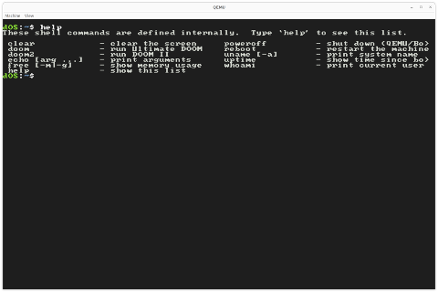
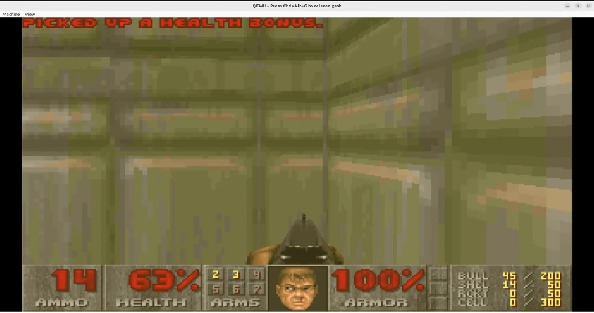
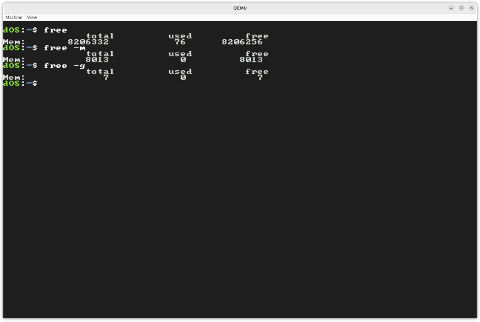
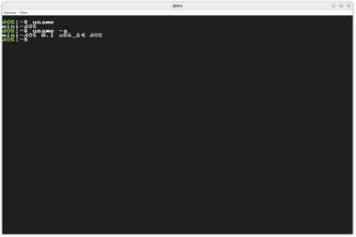
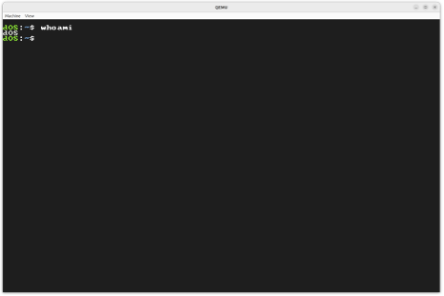

<div align="center">

<h1>mini-dOS</h1>

<p><b>직접 만든 커널 위에서 DOOM을 돌린다</b></p>


</div>

---

## 팀원

<table>
<tr>
  <th align="center">이름</th>
  <th align="center">학번</th>
  <th align="center">GitHub</th>
  <th>담당</th>
</tr>
<tr>
  <td align="center" nowrap>김보겸 (팀장)</td>
  <td align="center">32210**7</td>
  <td align="center"><a href="https://github.com/bogamie">@bogamie</a></td>
  <td>부트로더 및 커널 진입(Multiboot2 → Long Mode) · GDT/TSS · IDT 및 인터럽트 서브시스템 · 페이징(PML4 · Higher-half · Direct-map) · VMM · vmalloc · libc shim 전반 · PIT 틱 카운터</td>
</tr>
<tr>
  <td align="center" nowrap>최승원</td>
  <td align="center">32214**2</td>
  <td align="center"><a href="https://github.com/SeungwonChoi-kr">@SeungwonChoi-kr</a></td>
  <td>Buddy 할당자 · Slab 할당자 · GOP 프레임버퍼 및 비트맵 폰트 · 콘솔 드라이버 · 미니 쉘 · PS/2 키보드(Ring Buffer · shift/caps_lock) · DOOM glue 레이어(DG_* 6종) · WAD 로딩</td>
</tr>
</table>

---

## 왜 만들었나요?

OS 교과서는 페이징, 인터럽트, 메모리 관리를 설명하지만 직접 구현해본 적은 없었습니다.

mini-dOS는 그 질문에서 시작했습니다 — **x86-64 베어메탈 위에 직접 올린 커널로 DOOM(1993)을 돌릴 수 있을까?**

단순한 Hello World 커널이 목표가 아니었습니다. GRUB으로 부팅해 Long Mode에 진입하고, 페이지 테이블을 직접 구축하고, Buddy · Slab · vmalloc 메모리 할당자를 올리고, 인터럽트 핸들러를 등록하고, 프레임버퍼에 픽셀을 그리고, PS/2 키보드 입력을 받아 — 그 위에서 DOOM의 플랫폼 콜백(`DG_DrawFrame`, `DG_GetKey`, `DG_GetTicksMs`, `DG_SleepMs` 등 6종)을 커널 서비스에 연결했습니다.

---

## 시연 영상

<table>
<tr>
<td valign="top" width="55%">

<a href="https://youtu.be/Vz4IkK8DZVw">

</a>

<br/>

<a href="https://youtu.be/Vz4IkK8DZVw">

</a>

</td>
<td valign="top">

| 타임스탬프 | |
|---|---|
| `0:00` | `help` |
| `0:15` | `clear` |
| `0:22` | `echo` |
| `0:40` | `free` |
| `0:50` | `whoami` |
| `1:02` | `uptime` |
| `1:13` | `uname` |
| `1:34` | `poweroff` |
| `2:05` | `doom` |

</td>
</tr>
</table>

---

## 화면

| 미니 쉘 | DOOM |
|:---:|:---:|
|  |  |

**쉘 명령어**

| `free` | `uname` | `whoami` |
|:---:|:---:|:---:|
|  |  |  |

---

## 기술 스택


---

## 프로젝트 구조

Linux 트리를 본떠 서브시스템별로 최상위에 배치합니다.

```
.
├── arch/
│   └── x86_64/
│       ├── boot/          # boot.s (Multiboot2 → Long Mode)
│       ├── gdt/           # GDT / TSS 초기화
│       └── interrupt/     # IDT, ISR 스텁, 8259 PIC
├── drivers/               # 디바이스 드라이버
│   ├── input/             # i8042 (PS/2), 키보드
│   ├── tty/               # 시리얼(UART 16550), 콘솔, 미니 쉘
│   └── video/             # 프레임버퍼, 폰트
├── glue/                  # DOOM ↔ 커널 플랫폼 글루
├── init/
│   └── kmain.c            # 부팅 진입점
├── kernel/                # 아키텍처 무관 커널 핵심
├── mm/                    # 메모리 관리 (PMM, VMM, Slab, vmalloc)
├── libc/                  # POSIX shim 레이어 (DOOM용)
│   ├── include/
│   └── src/
├── doom/                  # vendored ozkl/doomgeneric
├── include/               # 커널 공용 헤더
│   ├── asm/               # x86 전용
│   ├── kernel/            # arch-neutral
│   ├── drivers/
│   └── mm/
├── linker.ld
└── Makefile
```

---

## 부팅 과정

```
GRUB
  ↓
Multiboot2 Loader
  ↓
arch/x86_64/boot/boot.s (32-bit)
  ↓
페이지 테이블 구축 (Identity-map + Higher-half + Direct-map)
  ↓
PAE / EFER.LME / Paging 활성화 → Long Mode 진입
  ↓
Higher-half 가상 주소로 전환
  ↓
init/kmain.c — kmain() 실행
  ↓
미니 쉘 루프
```

---

## 빌드 & 실행

```bash
make            # 빌드 (build/kernel.elf)
make iso        # ISO 생성 (build/myos.iso)
make run        # QEMU 실행
make run-debug  # QEMU + gdb stub :1234
```

**권장 환경:**

```
Ubuntu 22.04
x86_64-elf-gcc  (/opt/cross/bin/)
QEMU, GRUB, clangd
```

---

## 미니 쉘

부팅 후 `kmain()`에서 쉘 루프가 시작됩니다.

```
dOS:~$
```

| 명령어 | 설명 |
|--------|------|
| `clear` | 화면 초기화 |
| `doom` | DOOM 실행 (종료 시 쉘로 복귀) |
| `echo [...]` | 인자 출력 |
| `free [-m\|-g]` | 메모리 사용량 (KiB / MiB / GiB) |
| `help` | 명령어 목록 |
| `poweroff` | QEMU/Bochs 종료 |
| `reboot` | 재부팅 |
| `uname [-a]` | 시스템 이름 출력 |
| `uptime` | 부팅 후 경과 시간 |
| `whoami` | 현재 사용자 출력 |

---

## 헤더 네임스페이스

include 경로만 봐도 헤더의 정체가 드러나도록 설계했습니다.

| Include | 의미 | 예 |
|---------|------|----|
| `<asm/foo.h>` | x86 전용 (다른 아키텍처 포팅 시 교체) | `<asm/cpu.h>`, `<asm/idt.h>` |
| `<kernel/foo.h>` | arch-neutral 커널 서비스 | `<kernel/pit.h>`, `<kernel/multiboot.h>` |
| `<drivers/foo.h>` | 디바이스 드라이버 | `<drivers/framebuffer.h>` |
| `<mm/foo.h>` | 메모리 관리 | `<mm/vmm.h>`, `<mm/pmm.h>` |
| `<stdio.h>` 등 | libc shim (DOOM 및 일부 커널용) | `<string.h>`, `<stdio.h>` |

DOOM은 `glue/` 레이어를 통해서만 커널과 통신합니다. 경계를 넘는 것은 6개 콜백(`DG_DrawFrame`, `DG_GetKey`, `DG_GetTicksMs`, `DG_SleepMs` 등)뿐입니다.

---

## 구현 상태

- [x] Multiboot2 부팅
- [x] Long Mode 전환
- [x] GDT / TSS 초기화
- [x] Higher-half 커널 (가상 주소 `0xFFFFFFFF80000000`)
- [x] 페이징 (4KB / 2MB 페이지, PML4 기반)
- [x] 물리 메모리 관리 (Buddy PMM, 4KB–4MB)
- [x] Direct-map (`0xFFFF888000000000`)
- [x] IDT 구현
- [x] PIC (8259A) 초기화
- [x] 인터럽트 / 예외 처리 (ISR 스텁 + C 핸들러)
- [x] 시리얼 콘솔 (COM1)
- [x] PS/2 키보드 드라이버
- [x] 가상 메모리 관리 (VMM, ownership-aware)
- [x] Slab 할당자 (8B–2KB, 9개 캐시)
- [x] vmalloc (linked-list, first-fit)
- [x] libc shim (stdio, stdlib, string 등)
- [x] 프레임버퍼 콘솔 (GOP 기반, 8×8 비트맵 폰트)
- [x] 미니 쉘 (내장 명령어 10종)
- [x] DOOM 포팅 (WAD 로딩, 화면 출력, 키 입력, 타이머, 종료 후 쉘 복귀)
- [ ] 프로세스 / 스케줄러
- [ ] 시스템 콜
- [ ] 파일 시스템 (VFS + FAT32)
